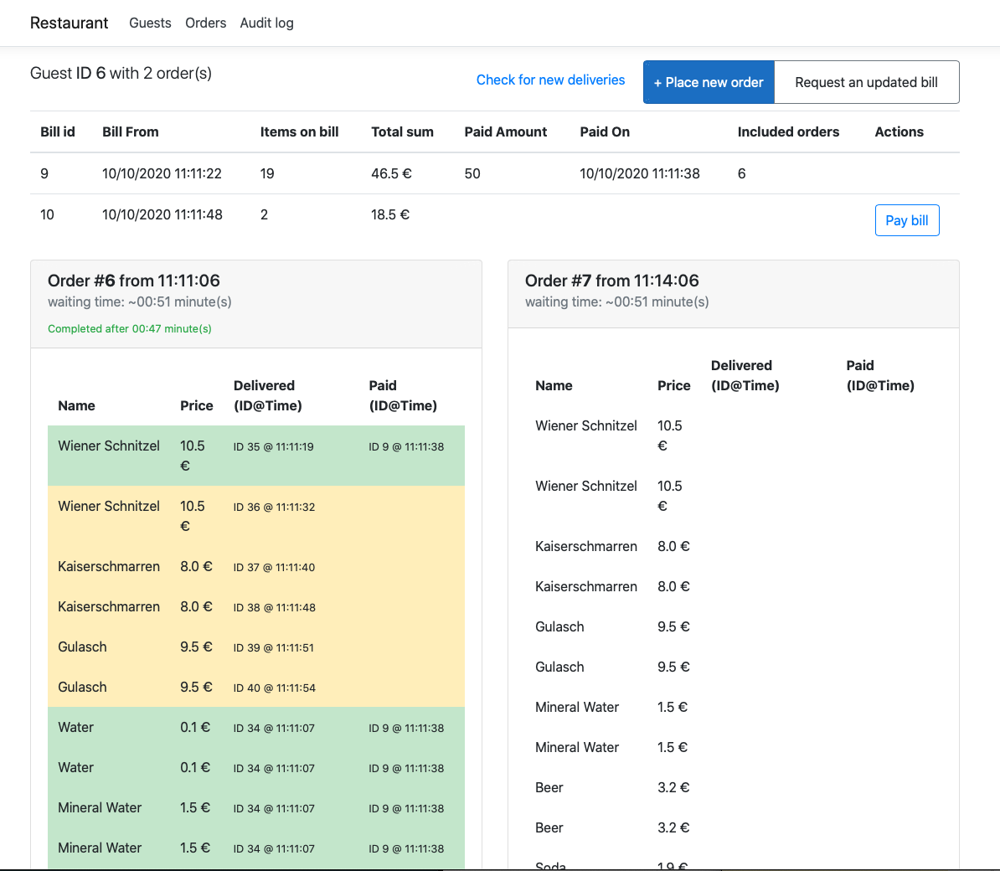
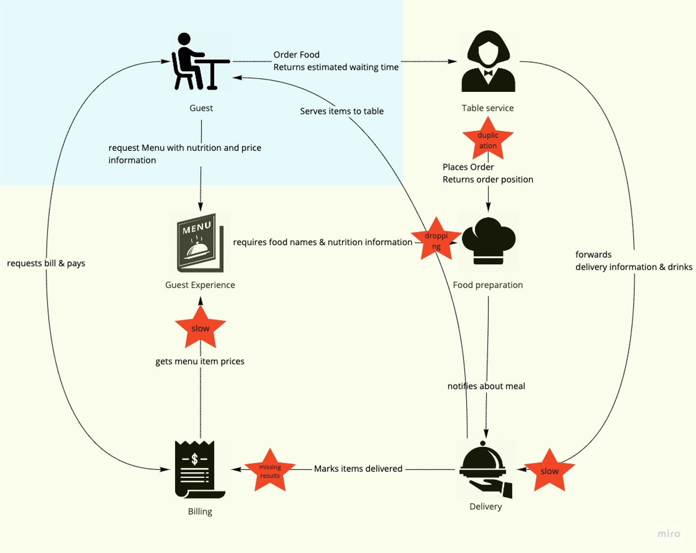

# The Restaurant Kata

This document describes a Kata for building and learning about distributed systems, inspired by [Greg Young](https://twitter.com/gregyoung)s restaurant example.

Imagine the following: you are entering a restaurant to order some food and drinks.
You pick up the menu from the table, study it and after you picked your meal, you contact the waitress to order a Wiener Schnitzel and a soda.
After a while, the assistant manager brings you the food, which was deliciously prepared by the cook.
Once you are finished, you ask for the bill, pay in cash and leave this nice place.
In this setting, we have a user, the guest, who is interacting with a system.
This system is composed of a lot of different actors, who are working together to fulfill the user's needs.
Each actor executes several tasks within their job, while they interact with other actors.

## Actors within our system

In this section, we describe the actors and their responsibilities in our restaurant.
The following picture shows a coarse overview of how the actors are connected.


### The guest - represents a system user

The customer - the guest - is hungry and thirsty and visits the restaurant for food and drinks.
Guests represent outside users, who are interacting with the system:

- guests request the menu, which contains products with nutrition information
- they issue orders with the waiter for the selected products from the menu
- guests wait to receive food and drinks delivered to them
- they request the bill and pay

### Guest experience - creating a pleasant visit

Provides a menu with daily offers tailored to customers, which is compliant with the legal rules of the country.
A manager is in charge of the restaurant and designs the menu, which describes all the items served by the restaurant.
Especially the manager is in charge of:

- the menu, containing all of the items which are offered to a customer.
  An item on the menu has a name, nutrition information and a price.
- to ensure the nutrition information is up-to-date with the ingredients served, and details about them are retrieved from the cook.
- the cashier asks for current item prices when a bill is created.

### Table service - helping the guest at the table

A waitress/waiter interacts with the guest when they order items from the menu.

- takes the order for several menu items from guests,
- forwards the food order to the food preparation,
- responds to the customer with an estimated waiting time, based on information from the cook and the waiter's experience
- forwards delivery information and drink orders to Delivery

### Food preparation - cooking a delicious meal

A cook prepares meals in the order they are requested.

- only orders for a single menu item can be placed at once
- meal preparation takes a defined time, which is calculated by the number of ingredients * 2.
  For example, a meal with 4 ingredients takes at least 8 seconds to prepare.
- the restaurant has only a limited amount of cooks available.
  For example, only 2 cooks can prepare meals and they are blocked for the preparation time.
- when food is ordered, the number of meals that are prepared before the requested one is returned.
  For example, if two meals are about to be prepared, and another order is requested, food preparation would return 3 to the waiter.
- when a meal is prepared it is placed on the counter after its preparation time and delivery is notified.
- provides a list of cookable meals with name and nutrition information

### Delivery - serving items

In delivery, an assistant manager ensures that all ordered items are delivered to the guest and that they are registered for billing.

- watches for prepared meals from the cook and picks them up
- prepares drinks upon request from table service
- delivers all items to the guest in the order they appear
- registers delivered items with the cashier for billing
- only a limited amount of assistant managers are available, e.g. 3 people are delivering items

### Billing - managing payment and money

The cashier keeps track of items a guest ordered, generates a bill and marks payment.

- knows up-to-date food prices, based on the manager's menu
- keeps track of delivered items for a guest
- generates a bill for the guest and offers payment via different means
- marks bill as paid

## Part 1 - Building the system in a naive way

The goal of the first exercise is to dive into the domain, while you learn about the actors and how they are connected.
Your focus should ly on bringing value to the guest, and not on building a perfect distributed system!

We build each actor as a standalone application and connect them to form a distributed system.
The existing customer application will act as a representation of the user and connect to your application.
To keep things simple from a technical point of view, the following guidelines should be respected:

- each actor is implemented as an independent runnable application, and it can be started with a simple CLI command
- configuration parameters of an application can be set or overridden via environment variables
- all communication is done via unsecured HTTP and the exposed port can be configured via a dedicated environment variable (e.g. `PORT` or `ASPNETCORE_URLS`)
- log messages are written to the console / `STDOUT`
- durable persistence is not needed, so storing data in memory and hard coding e.g. the menu or prices is sufficient.

### Starting points

The guest is simulated by the [customer application](./customer) and communicates via the following contracts with your services:

- The customer itself exposes some endpoints described [here](services/Customer.yaml), which can be called by other systems
- [Guest experience](services/GuestExperience.yaml), [Table Service](services/TableService.yaml) and [Billing](services/Billing.yaml) define contracts that are called by the customer application
- documentation about the service description files can be read in the following [readme](./services/Readme.md)
- start with specifying the communication contracts between the actors
- there are [`templates`](./templates/Readme.md) for a quick start available
- focus on creating a runnable solution and make sure you understand the problem.
  We will iterate towards a better and more robust solution in the following parts of the exercise.

### Challenges & Reflection

- What are the concrete duties of an actor / a component?
- What does the contract between these components look like?
- How are they connected?
- How many parallel requests can the system handle?
- What about waiting times / SLAs for each actor?

### Call to Action

To summarize, the goals of the first part of the Kata are:

- to learn about the actors, rules and connections of the restaurant, while
- building a naive distributed system based on HTTP calls,
- to create the basis for the following parts.

In the end, you should be able to connect the developed services to the customer frontend and you should have a similar experience as shown in the following video.

[](https://youtu.be/PcRHigcAZ7E)

## Part 2 - The fallacies of distributed computing

The goal of the second exercise is to understand how the system reacts to stress, tension and failures.
We will introduce artificial constraints, bugs and problems into your code to study the reaction of our system.
Then we introduce and apply various patterns to improve the system and make it more robust and resilient.

### Constraints / Bugs / Problems

The following constraints should be implemented for each actor, visualized in the following image.
Ensure that configuration values are exposed via the mentioned environment variables!



#### Slow Delivery

The assistant manager likes to go outside on the balcony for a smoke every once in a while.
While he is on break, he is not responding right away to the delivery & drink information from `Table Service`, but once he is back he will confirm to the waiter.

In distributed systems sometimes requests or messages to a service are way slower than you expect, but they still succeed.

The response from `Delivery` to the call from `Table Service` gets delayed for a certain amount of time.
With a configuration value of `SLOW_DELIVERY` set to e.g. `0.1` 10% of the requests from `Table Service` to `Delivery` receive their response after a configured delay.
`SLOW_DELIVERY_DELAY` set to e.g. `60` means that an artificial delay of 60 seconds is added to the response.

#### Busy Cook

The cook enjoys preparing food and when he is 'in the zone' other requests go unnoticed, especially those annoying interruptions by the manager about nutrition information of the meals.

When services are called from a consumer they are sometimes down, have bugs, respond with an error or sometimes they simply do not reply at all.

`BUSY_COOK` set so `0.1` indicates that 10% of the calls from `Guest Experience` to `Food Preparation` to retrieve nutrition information fail with an HTTP 500 error.

#### Forgettable Waiter

Sometimes our waiter forgets if he already placed an order for a guest with the cook.
To make sure the guest receives her meal, the waiter places the order another time with `Food Preparation`.

Sometimes in distributed systems messages or calls get duplicated and the same content is presented several times to the consumer.

There should be a configuration value `FORGETTABLE WAITER_RATIO` in `Table Service` set to e.g. `0.1`, so that 10% of food orders are placed two times with the cook.
This means that the same call from `Table Service` to `Food Preparation` is issued twice.

#### Occupied Cashier

The cashier is always busy in keeping track of the bills, while she is collecting and counting money.
This leads to the situation that from time to time notifications for delivered items are not recognized by her.

When services are called from a consumer they are sometimes down, have bugs, respond with an error or sometimes they simply do not reply at all.

`BUSY_CASHIER` set so `0.1` indicates that 10% of the calls from `Delivery` to `Billing` to mark an item delivered to the customer fail with an HTTP 500 error.

#### Overworked Manager

The restaurant's manager is constantly overworked and forgets about the nutrition information that was received from the cook.

In distributed systems sometimes requests or messages to a service are way slower than you expect, but they still succeed.

The response from `Guest Experience` to the call from `Billing` about menu prices gets delayed for a certain amount of time.
With a configuration value of `OVERWORKED_MANAGER` set to e.g. `0.1` 10% of the requests from `Billing` to `Guest Experience` receive their response after a configured delay.
`OVERWORKED_MANAGER_DELAY` set to e.g. `60` means that an artificial delay of 60 seconds is added to the response.

## Reflection

- How did the overall system react?
- How was the user experience for the customer?
- How much throughput did we have?
- How did several parameters influence the stability of the system?

### Patterns

With local, tactical patterns the stability and resilience of the system can be improved without introducing fundamental changes to the system.
The following section outlines some ideas about potential patterns together with additional documentation:

- Retry
  Try to re-apply a request for a limited amount, sometimes combined with back-off times, e.g. <https://docs.microsoft.com/en-us/azure/architecture/patterns/retry> or <https://github.com/App-vNext/Polly/wiki/Retry>.
- Timeout / TTL
  Specify an explicit timeout to control the maximum duration of a request and allow a controlled termination - <https://github.com/App-vNext/Polly/wiki/Timeout>
- Circuit Breaker
  Instead of calling a faulty service several times, stop the communication early - <https://docs.microsoft.com/en-us/azure/architecture/patterns/circuit-breaker>, <https://github.com/App-vNext/Polly/wiki/Circuit-Breaker>
- Correlation / Idempotency
  Providing unique identifiers with requests allow the server to correlate or deduplicate requests - <https://tkg.codes/posts/client-side-resource-ids>, <https://chrisrichardson.net/post/microservices/patterns/2020/10/16/idempotent-consumer.html>
- Cache
  A cache can sometimes be used as a fallback mechanism in case of a faulty service and returns a degraded result - <https://github.com/App-vNext/Polly/wiki/Cache>
- Pipes and Filters
  Sometimes multiple simple patterns can be combined to achieve a more resilient system - <https://github.com/App-vNext/Polly/wiki/Fallback>, <https://github.com/App-vNext/Polly/wiki/PolicyWrap>
- Decoupled Invocation / Request & Reaction
  Instead of using a plain RPC call and waiting (in a blocking way) for the response, embrace the asynchronicity - <https://arnon.me/soa-patterns/decoupled-invocation/>, <https://arnon.me/soa-patterns/request-reaction/>
- Transaction
  Introduce a set of local transactions to isolate failures and allow retries <https://arnon.me/soa-patterns/transactional-service/>

Note: the idea is to implement the patterns on your own and not just integrate a prebuilt library!

## Part 3 - Decoupling via Messages

In the 3. part of the Kata we will look into decoupling the services via messaging.
With the help of the message broker, [RabbitMQ](https://www.rabbitmq.com/) actors will communicate via commands, events or document messages.
In addition to the communication via messages, the errors and the resilience patterns introduced in the 'Fallacies of distributed computing' part should be translated into their equivalent messaging part.

### Defining contracts

As the first step the internal contracts should be reviewed and messaging should be introduced where appropriate.
Note: the contracts towards the customer should not be changed!

Essentially defining contracts consists of the following parts:

- Discuss which types of messages (Command, Event, Document) should be used for which internal communication
- Sketch the message contracts and channels with the help of [AsyncAPI](https://www.asyncapi.com/) in one file.
  Some information on generating documentation with AsyncAPI can be found [here](services/Readme.md).

### Implement and use the contracts

Now we use and introduce the async contracts into the existing implementation with the following steps

- Use RabbitMQ as the central Broker for all services.
  With the following Docker command, RabbitMQ can be hosted together with the management console on its default port.

      docker run -d --hostname restaurant-rabbit --name restaurant-rabbit -p 5672:5672 -p 15672:15672 rabbitmq:3-management

  Note: the default user `guest` and password `guest` should be sufficient for this Kata.
- Provision (create) the necessary exchanges, queues and bindings as defined in the `AsyncAPI`-contracts in RabbitMQ in an automated way
- Implement the communication with RabbitMQ and re-apply existing resilience patterns

### Remarks on the implementation

When introducing messaging a message handler pipeline (['Pipes and Filters'](https://docs.microsoft.com/en-us/azure/architecture/patterns/pipes-and-filters)) helps to separate implementation concerns.
E.g. each resilience pattern can be implemented as a dedicated handler and the handlers can be wired into a pipeline upon startup.

```c#
class LoggingHandler<T> : IHandleMessages<T> {
  private readonly IHandleMessages<T> _next;
  private readonly ILogger<T> _logger;
  LoggingHandler( ILogger<T> logger, IHandleMessages<T> next){
    _next = next;
    _logger = logger;
  }

  public void Handle(T message){
    _logger.LogInformation("About to handle message " + message);
    try {
      _next.Handle(message);
      _logger.LogDebug("Successfully handled message " + message);
    } catch (Exception e) {
      _logger.LogException(e, "Failed on handling message " + message);
      throw;
    }
  }
}

// Startup / handler wiring:
var cookMealChain =
  new LoggingHandler(
    logger: loggingFactory.CreateLogger(),
    new RetryOnErrorHandler(
      retries: 3,
      new TransactionalHandler(
        new CookMealHandler(/* cook dependencies */)
      )
    )
  );


// caller code from RabbitMQ somewhere
cookMealChain.Handle(new CookMeal(...));
```

### Call to Action

To summarize the tasks of the third part:

- Define new internal contracts based on message semantics
- Implement them with the help of RabbitMQ
- Port existing errors/bugs/constraints introduced in the 2nd part to the 3rd.
- Fix them with existing or new, more appropriate patterns
- Summarize and review your findings