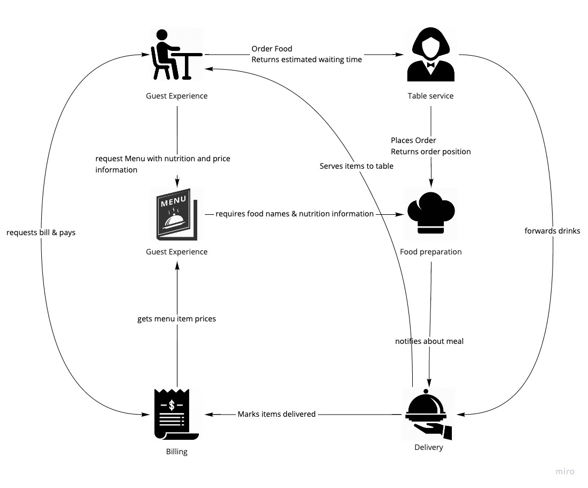

# The Restaurant Kata

This document describes a Kata for building and learning about distributed systems, inspired by [Greg Young](https://twitter.com/gregyoung)s restaurant example.

Imagine the following: you are entering a restaurant to order some food and drinks.
You pick up the menu from the table, study it and after you picked your meal, you contact the waitress to order a Wiener Schnitzel and a soda.
After a while the assistant manager brings you the food, which was deliciously prepared by the cook.
Once you are finished, you ask for the bill, pay in cash and leave this nice place.

In this setting we have a user, the guest, who is interacting with a system.
This system is composed of a lot of different actors, who are working together to fulfill the users needs.
Each actor executes several tasks within their job, while they interact with other actors.

## Actors within our system

In this section we describe the actors and their responsibilities in our restaurant.
The following picture shows a coarse overview on how the actors are connected.

### The guest - representing a system user

The customer - the guest - is hungry and thirsty and visits the restaurant for food and drinks.
Guests represent outside users, who are interacting with the system:

- guests request the menu, which contains products with nutrition information
- they issue orders with the waiter for the selected products from the menu
- guests wait to receive food and drinks delivered to them
- they request the bill and pay

### Guest experience - creating a pleasant visit

A manager is in charge of the restaurant and designs the menu, which describes all the items served by the restaurant.
Especially the manager is in charge of:

- the menu, containing all of the items which are offered to a customer.
  A item of the menu has a name, a nutrition information and a price.
- to ensure the nutrition information is up-to-date with the ingredients served, details about them are retrieved from the cook.
- the cashier asks for current item prices when a bill is created.

### Table service - helping the guest at the table

A waitress/waiter interacts with the guest, when they order items from the menu.

- takes the order for several menu items from guests,
- forwards the food order to the food preparation,
- responds to the customer with an estimated waiting time based on information from the cook and the waiter's experience
- forwards delivery information and drink orders to Delivery

### Food preparation - cooking a delicious meal

A cook prepares meals in the order they are requested.

- only orders for a single menu item can be placed at once
- a meal preparation takes a defined time, which is calculated by the number of ingredients * 2.
  As example a meal with 4 ingredients takes at least 8 seconds to prepare.
- the restaurant has only a limited amount of cooks available.
  As example only 2 cooks can prepare meals and they are blocked for the preparation time.
- when food is ordered, the number of meals that are prepared before the requested one is returned.
  As example if two meals are about to be prepared, and another order is requested, food preparation would return 3 to the waiter.
- when a meal is prepared it is placed on the counter after it's preparation time and delivery is notified.
- provides a list of cookable meals with name and nutrition information

### Delivery - serving items

In delivery an assistant manager ensures that all ordered items are delivered to the guest and that they are registered for billing.

- watches for prepared meals from the cook and picks them up
- prepares drinks upon request from table service
- delivers all items to the guest in the order they appear
- registers delivered items with the cashier for billing
- only a limited amount of assistant managers are available, e.g. 3 people are delivering items

### Billing - managing payment and money

The cashier keeps track of items a guest ordered, generates a bill and marks payment.

- knows up-to-date food prices, based on the managers menu
- keeps track of delivered items for a guest
- generates a bill for the guest and offers payment via different means
- marks bill as payed

## Part 1 - Building the system in a naive way

The goal of the first exercise is to dive into the domain while you learn about the actors and how they are connected.
Your focus should ly on bringing value to the guest, and not on building a perfect distributed system!

We build each actor as a standalone application and connect them together to form a distributed system.
The existing customer application will act as representation of the user and connect to your application.
To keep things simple from a technical point of view, the following guidelines should be respected:

- each actor is implemented as independent runnable application, and it can be started with a simple CLI command
- configuration parameters of an application can be set or overridden via environment variables
- all communication is done via unsecured HTTP and the exposed port can be configured via a dedicated environment variable (e.g. `PORT` or `ASPNETCORE_URLS`)
- logs messages are written to the console / STDOUT
- durable persistence is not needed, so storing data in memory while hard coding e.g. the menu or prices is sufficient.

### Starting points

The guest is simulated by the [customer application](./customer) and communicates via the following contracts with your services:

- The customer itself exposes some endpoints described [here](services/Customer.yaml), which can be called by other systems
- [Guest experience](services/GuestExperience.yaml), [Table Service](services/TableService.yaml) and [Billing](services/Billing.yaml) define contracts that are called by the customer
- a documentation about the service description files can be read in the following [readme](./services/Readme.md)
- focus on creating a runnable solution and make sure you understand the problem.
  We will iterate towards a better and more robust solution in the following parts of the exercise.

### Call to Action

So to summarize it again, the goals of the first part of the Kata are:

- to learn about the actors, rules and connections of the restaurant, while
- building a naive distributed system based on HTTP calls,
- to create the basis for the following parts.

At the end you should be able to connect the developed services to the customer frontend and you should have a similar experience as shown in the following video.

## Part 2 - The fallacies of distributed computing

The goal of the second exercise is to understand how the system reacts to stress and tension and failures.
We will introduce artificial constraints, bugs and problems into your code to study the reaction of our system.
Then we will introduce and apply patterns to improve our system and make it more robust.

### Constraints / Bugs / Problems

The following constraints should be implemented for the each actor and make sure that all configuration values are exposed via the mentioned environment-variable!

#### Clumsy Delivery

Every once in a while the assistant manager in `Delivery` drops a prepared meal.
Usually this happens while serving the meal to the customer, after `Billing` was notified about the delivery!

The idea behind this constraint is that every once in a while expected calls in a distributed system might fail, especially if multiple calls are involved as part of the same (logical) action.

From an implementation point of view this means that a notification to `Customer` with the meal gets lost, but the call to `Delivery` succeeds.
There can be a configuration value, e.g. `CLUMSY_DELIVERY_RATIO`  set to `0.1` to drop 10% of the prepared meals.

#### The overeager Cook

The cook enjoys preparing food and sometimes too much is cooked for an ordered item.
Not one piece should be wasted, so our cook simply places the same item two times on the counter, which is then picked up by `Delivery`.

Sometimes in distributed systems messages or calls get duplicated and the same content is presented several times to the consumer.

There should be a configuration value `OVEREAGER_COOK_RATIO` in `Table experiecne` set to e.g. `0.1`, so that 10% of the meals are prepared two times.
When a meal is prepared two times, the same message is simply forwarded another time from `Food Preparation` to `Delivery`!

#### Slow Waiter

The waiter likes to go for a smoke every once in a while, usually after he took the order from the customer and he forwarded the meal items to the cook.
So before he told `Delivery` what they need to deliver to which guest!

In distributed systems sometimes requests or messages to a service are way slower than you expect, but they still succeed.

Calls to `Delivery` from the `Guest Experience` get delayed for a certain amount of time, but requests to the cook happen right away.
With a configuration value of `SLOW_WAITER` set to e.g. `0.1` 10% of the requests to delivery start at a later point in time.
`SLOW_WAITER_DELAY` set to e.g. `60` means that an artificial delay of 60 seconds is added to that request.

#### Busy Cashier

The cashier is always busy in keeping track of the bills while he is collecting and counting money.
From time to time notifications for delivered items are not recognized by her.

When services are called from a consumer they are sometimes down, have bugs, response with an error or sometimes they simply do not reply at all.

`BUSY_CASHIER` set so `0.1` indicates that 10% of the calls from `Delivery` to `Billing` to mark an item delivered to the customer fail with an HTTP 500 error.

#### Overworked Manager

The restaurant's manager is constantly overworked and forgets about the nutrition information that was received from the cook.

Sometimes messages are sent successfully from a service, but don't appear or get lost on the consumer side.

With a configuration value of `OVERWORKED_MANAGER` set to `0.1` 10% of the results of the calls to `Food Preparation` for retrieving nutrition information get lost within the `Guest Experience` implementation.
E.g. a service call is issued, but the results do not arrive / are discarded in the implementation.

## Reflection

- How did the overall system react?
- How was the user experience for the customer?
- How much throughput did we have?

### Patterns

__TODO__

## Part 3 - Decoupling via Messages

__TODO__
