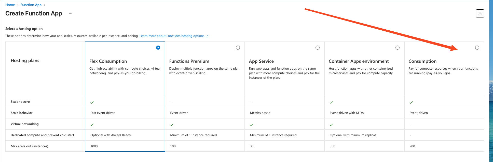
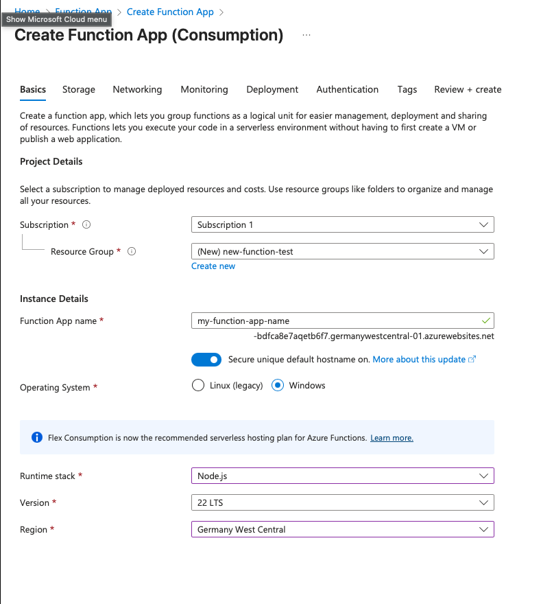
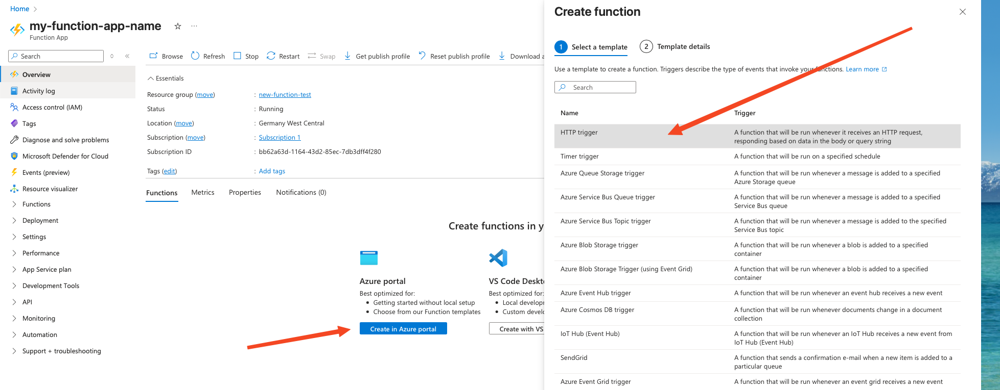
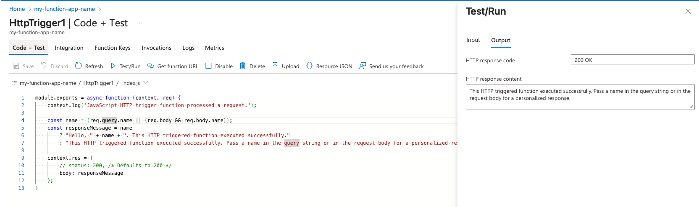
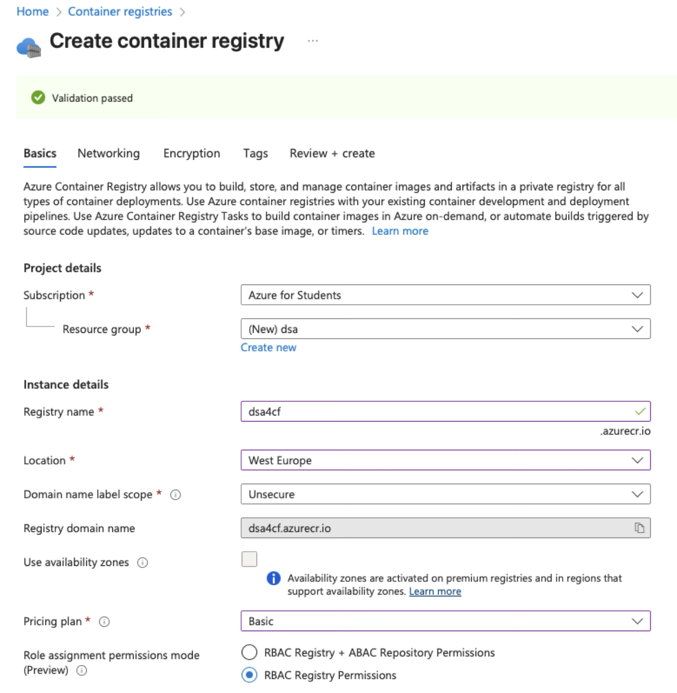
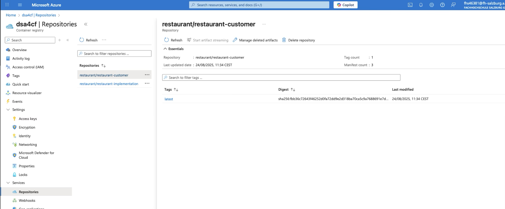

# Cloud Workshop

The goal is to experiment with a Hyperscaler, deploy a couple of workloads and eventually run a version of the Kata in the cloud.

## Prerequisites

- Install [Docker](https://www.docker.com/products/docker-desktop/) or similar tools (e.g. [Podman](https://podman-desktop.io))
- Install [Azure CLI](https://learn.microsoft.com/en-gb/cli/azure/install-azure-cli?view=azure-cli-latest) (`brew install azure-cli`) and make [yourself familiar](https://learn.microsoft.com/en-gb/cli/azure/what-is-azure-cli?view=azure-cli-latest) with it
    - Make sure you have an existing Azure Account ([free Student Account](https://learn.microsoft.com/en-us/azure/education-hub/about-azure-for-students) can be created [here](https://azure.microsoft.com/en-gb/free/students/))
    - Confirm you've connected your CLI with your Azure Account by running`az login`

## Play around with Azure Functions

First we will try out [Azure Functions](https://learn.microsoft.com/en-gb/azure/azure-functions/) as a runtime for simple HTTP services.
The benefit of choosing Azure Functions is that:
- we only pay what we use during handling a request (with a generous free-tier!),
- it's simple to program and deploy, and
- Azure Functions have build-in Logging & Monitoring for Observability.

### Creating Function via the UI

One way to create an Azure Function is to use the provided UI from the Azure Portal.
(For more expert users: feel free to follow [this guide](https://learn.microsoft.com/en-us/azure/azure-functions/create-first-function-azure-developer-cli?tabs=linux%2Cget%2Cbash%2Cpowershell&pivots=programming-language-javascript) that provisions a function from your machine.)
For now we will choose the 'Consumption'-Plan to be able to create Functions using the Web-Editor in the Portal

Then create a new function within a new resource-group in the `Germany West Central` region using the `Node.js` runtime stack:

The remaining parameters can be left with their defaults and on the final screen click 'Create' and wait for the completion of the deployment (this can take 1-3 minutes).

Once it's finished search / navigate to the newly created function!

#### Helpful tools to use functions

In order to invoke Azure functions from your machine you will need a tool to call an HTTP API.
Take your preferred tool or pick one (or several) from the the following list:

1) `curl` (installed on Mac via `brew install curl`) to call an HTTP endpoint.
   use `curl -i <URL>` to call an GET HTTP endpoint and see the response in the shell.
2) `hey` (installed on Mac via `brew install hey`) to call an HTTP endpoint several times (to 'load test' something)
   use `hey -n 1000 <URL>` to call an endpoint for 1000 times or `hey -z 10s <URL>` to call an endpoint for 10 seconds
3) [Bruno](https://www.usebruno.com) (or via `brew install bruno`) if you prefer a more UI based tool to test APIs.

#### Review and use the default function endpoint

In the functions main screen navigate to the 'Azure portal' action and select the `HTTP trigger` template and create it with the default options.

Afterwards you should get a screen similar to this screen that allows you to 1) `Test/Run` your function and 2) `Get function URL` for invoking it locally with a tool of your choice.

**Assignment A** 
1. try to understand the functions default code,
2. play around a bit with invoking the function via the Web-Portal,
3. invoke the function via the URL from your laptop (e.g. using `curl` or any other tool for calling HTTP-APIs),
4. investigate the `Invocations` and `Metrics` tabs after invoking the function,
5. create some artificial load on the function by invoking the function often (e.g. write a small script or use the tool `hey` to call the HTTP endpoint)

#### Modify the default function endpoint

Now we will use the editor in the `Code + Test` tab to modify the function code in different ways.
For each modification we will invoke the function several times and capture our findings.

**Assignment B**
1. Change the function to throw an error on each invocation (hint: use `throw "Error";`)
2. Call the function several times - what can be observed in the portal and the responses?

**Assignment C**
1. Change the function to sleep/wait for a couple of seconds (hint: use e.g. `await new Promise(r => setTimeout(r, 2000));` as a sleep implementation)
2. Call the function several times - what can be observed in the portal and the responses?

**Assignment D**
1. Change the function to sometimes/randomly either sleep/wait or fail with an error (hint: use e.g. `Math.random()` and then check if the value is above or below a threshold to decide which way you 'fail')
2. Call the function several times - what can be observed in the portal and the responses?

## Execute the Kata in the cloud

We will deploy the first version (if you dare: the second version) of the Kata as distributed application in Azure.

For this exercise you can either use the Azure Portal/the UI - or follow the proposed `az` CLI commands!

### Prepare everything for the images

First we need to create a private container registry to hold our container images that we will deploy afterwards.

#### Using the UI

Search for 'Container Registry' and create a new one.

- Create a new resource group that will host your application (in the screenshot `dsa` is used)
- You need to provide a unique registry name: use `das25<group-number>`
- Make sure you choose an appropriate region (e.g. `West Europe` or `Austria East`)
- Pricing should be the `Basic` plan
- The rest of the settings can be kept with the defaults

#### Using CLI

First create a resource group to hold our application

    az group create --name dsa --location austriaeast

Then we add the container registry

    az provider register --namespace Microsoft.ContainerRegistry
    az acr create --name das25<group-number> --resource-group dsa --sku Basic
   
### Build and Push Images to the registry

Now we have a container registry that can host our application images - let's prepare the images and push them!

On your hosts CLI make sure your logged in the container registry using the following command

    az acr login --name das25<group-number>

When we build images on our machine we need to make sure that containers are build with `linux/arm64`. 
One way to achieve this can be done via multi builds, that can be enabled via the following command

    docker buildx create --use

Now we can build and push all docker images from our applications

//    docker buildx build --platform linux/amd64,linux/arm64 . -t restaurant-implementation
    docker buildx build --platform linux/amd64,linux/arm64 --tag das25<group-number>.azurecr.io/restaurant/restaurant-implementation --push . 
//  docker buildx build --platform linux/amd64,linux/arm64 customer -t restaurant-customer
    docker buildx build --platform linux/amd64,linux/arm64 --tag das25<group-number>.azurecr.io/restaurant/restaurant-customer:latest --push customer 

Then push the image to the container registry

    docker tag restaurant-implementation dsa4cf.azurecr.io/restaurant/restaurant-implementation
    docker push --platform linux/amd64,linux/arm64 dsa4cf.azurecr.io/restaurant/restaurant-implementation

    docker tag restaurant-customer dsa4cf.azurecr.io/restaurant/restaurant-customer
    docker push --platform linux/amd64,linux/arm64 dsa4cf.azurecr.io/restaurant/restaurant-customer

#### Verify images work locally

Now pull and start the images you've pushed to the registry back to your machine to verify everything worked fine sofar.

    docker pull das25<group-number>.azurecr.io/restaurant/restaurant-customer:latest

### Prepare the Container App to run our images

    az containerapp create

Run Image with correct configuration (locally)

    docker run --rm -it \
        -p 5100:5100 \
        -e ASPNETCORE_URLS=http://+:5100 \
        -e DOTNET_ENVIRONMENT=DockerLocal \
        -e APIS__FoodPreparation="http://host.docker.internal:5100/FoodPreparation/" \
        -e APIS__Delivery="http://host.docker.internal:5100/delivery/" \
        -e APIs__GuestExperience="http://host.docker.internal:5100/guestexperience/" \
        -e APIS__TableService="http://host.docker.internal:5100/tableservice/" \
        -e APIS__Billing="http://host.docker.internal:5100/billing/" \
        -e APIS__Customer="http://host.docker.internal:5000/" \
        restaurant-implementation
 

Run customer

    docker run --rm -it \
        -p 5000:5000 \
        -e ASPNETCORE_URLS=http://+:5000 \
        -e DOTNET_ENVIRONMENT=DockerLocal \
        -e APIs__GuestExperience="http://host.docker.internal:5100/guestexperience/" \
        -e APIS__TableService="http://host.docker.internal:5100/tableservice/" \
        -e APIS__Billing="http://host.docker.internal:5100/billing/" \
        restaurant-customer
 

 Application URLs

 https://implementation.wonderfuldesert-8dec7f6a.westeurope.azurecontainerapps.io
 https://customer.wonderfuldesert-8dec7f6a.westeurope.azurecontainerapps.io 